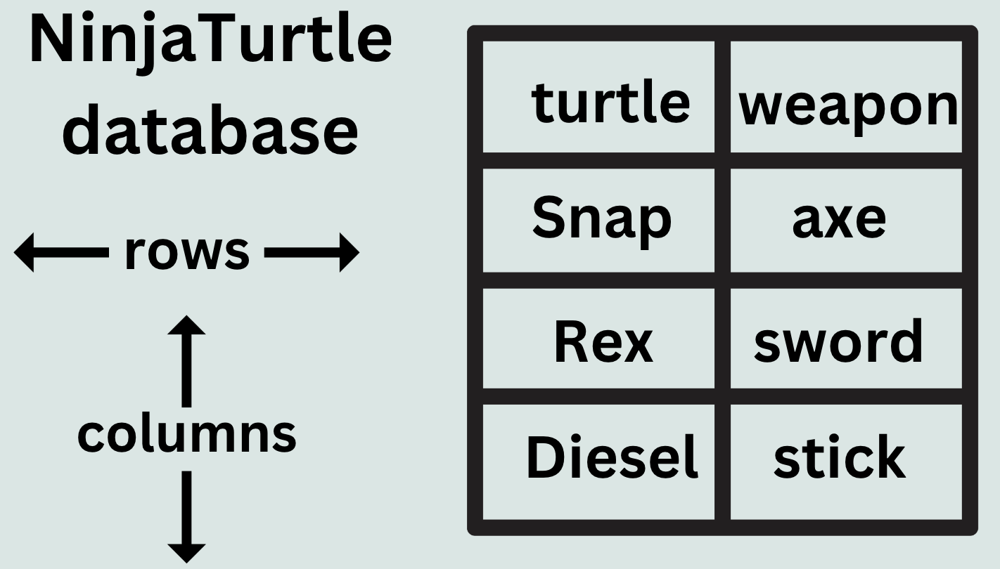

## Intro to Databases 1/10/24

## Domain specific languages
- performs a task: RSPEC, HTML, Postgres

## General purpose languages
-  syntax or structure for the code: JavaScript, Ruby

## Database:
- a container to store data

## SQL (Structured Query Language)
- domain specific language that gives the ability to evaluate/manage databases. 

### PostgreSQL: 
- object relational database management system (ORDMS)
- flavor of sql that is very OOP

## relational database: 
- structures/organizes the database into rows and columns within a table

## How does a database relate to a Ruby class?
```rb
# ruby class
class NinjaTurtle

  # helper method to create getter/setter methods 
  attr_accessor :turtle, :weapon
  
  # initialize method is automatically called
  def initialize(turtle, weapon)
    @turtle = turtle
    @weapon = weapon
  end

  # custom methods
  def greet
    "Cowabunga! I am #{@turtle}."
  end

  def attack
    "#{@turtle} performs an attack with the #{@weapon}."
  end
end

josh = Leonardo.new('Snap', 'throwing axe')
p josh

# # output: #<Leonardo:0x0000000103d3db88 @turtle="Snap", @weapon="throwing axe">
```

## relational database 
- representation of NinjaTurtle class and objects


- database columns: represents the attribute as well as datatype or class of the expected value

- database rows: represents each object with values
    - database instance: each object, also the rows, aka each individual record or data entry

- database table: consists of all the rows and columns for that database, structured collection of data

- schema: a record of the current structure/status of the database which includes names of tables, as well as the names and data types of columns

- primary key: a unique identifier for each instance of the database, automatically assigned, default datatype is integer

```rb
# Each data entry or instance is stored as an object with key:value pairs
# primary key represented by the id attribute
  {
    id: 1, 
    turtle: 'Snap',
    weapon: 'throwing axe'
  }
```

## PostgreSQL

## CRUD
Database Management System allows the following:
Create - make a new database instance
Read - display or read that instance
Update - edit or modify that instance
Delete - remove that instance

database query - request about the data in the database, action taken upon that data. Queries allow you to retrieve, insert, update, and delete data in tables.

## ALL Instances
SELECT statement - designates which columns need to be queried
FROM - designates the table that the columns belong to
* - splat, universal selector, to state all instances or columns

```sql
SELECT *
FROM country
```

## First 10 instances showing only the name, continent, and region columns
- LIMIT: keyword that restricts the number of instances returned by a query
```sql
SELECT name, continent, region
FROM country
LIMIT 10
```

## Setting a condition to see only the continent of Asia
WHERE clause: allows a condition to be met to display specified instances, filters the instances
```sql
SELECT name, population, lifeexpectancy
FROM country
WHERE continent = 'Asia'
```
### Operators
- equality: =, !=
- relational: >, <, >=, <=
- logical: AND, OR, NOT

## only countries with a population less than 1,000,000
```sql
SELECT name, continent, population
FROM country
WHERE population < 1000000
```
### shorthand for zeros
- instead of 1000000
- 1e6

## only countries with a population less than 1,000,000 in Asia
```sql
SELECT name, continent, population
FROM country
WHERE population < 1e6 
AND continent = 'Asia'
```

## wildcard: allows to query for a sequence of characters that are expected in a value
- denoted with wildcard operator (%)
- uses LIKE: keyword used for pattern matching
```sql
SELECT name, continent, population
FROM country
WHERE population < 1e6 
AND continent LIKE 'South Ame%'
```
